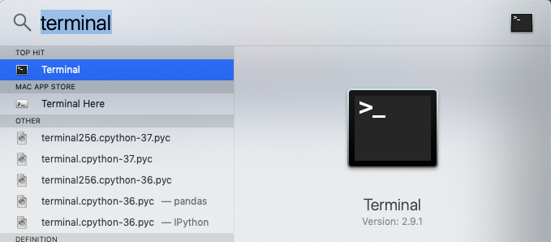
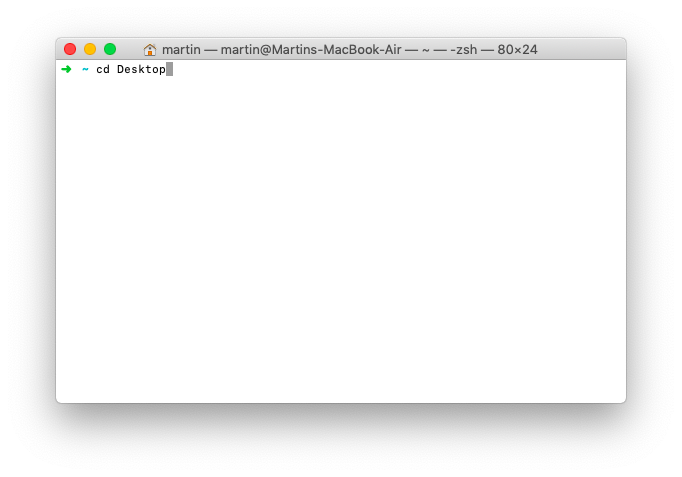
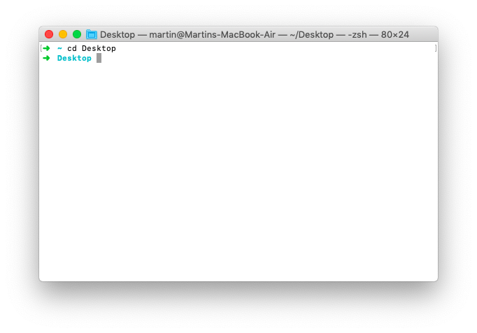
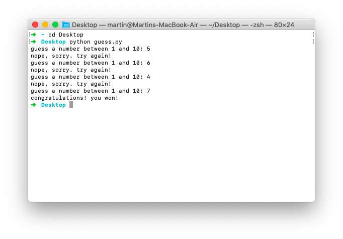

# Code Is Just Text

In the previous post you've learned how to write your code into a plain text editor and save it as a Python file. If you haven't written the code, or lost it in the depths of your Desktop, you can copy it [from this online resource](https://gist.github.com/martin-martin/d2f0bf7a6187a4e05d847b06e2bcee1d). In this lesson you will learn how to execute the file you wrote in order to finally play the game!

**Note**: If you built the game in [repl.it](https://repl.it/) all you need to do is press _Run_. Nevertheless, read through this text and come back to give it a try once you have Python installed.

### Play the Game

Well done so far! :) To play your game on your computer you need to run the Python file you just created. To do this on MacOS, open up your **Terminal**. Press <kbd>Cmd</kbd>+<kbd>Space</kbd> to open up Spotlight, and type _Terminal_, then press <kbd>Enter</kbd>:



This will open up your Terminal, a tool that programmers use on a daily basis. If you join one of our courses, you will get to know your Terminal in much more detail, but for now don't worry about it too much. Just type the following in there:

```bash
cd ~/Desktop
```



This will teleport you to your Desktop, where you saved the `guess.py` file that contains your code-text.



Now you finally get to play your guess-the-number game. Since you wrote it in Python, you need to also _start_ it using Python. In your terminal, type the following and press <kbd>Enter</kbd>:

```bash
python guess.py
```

And lo and behold! Here you are! Ready to play your game:



If you want to play again after it finished, you can press the <kbd>up</kbd> arrow once and your terminal will show you the previous command:

```bash
python guess.py
```

Pressing <kbd>Enter</kbd> will start the program again from the beginning.

Have fun guessing the number! :D

---

Learn more and get yourself started working with one of the most popular programming languages in our [Python Online Bootcamp](https://codingnomads.co/courses/python-bootcamp-online/).