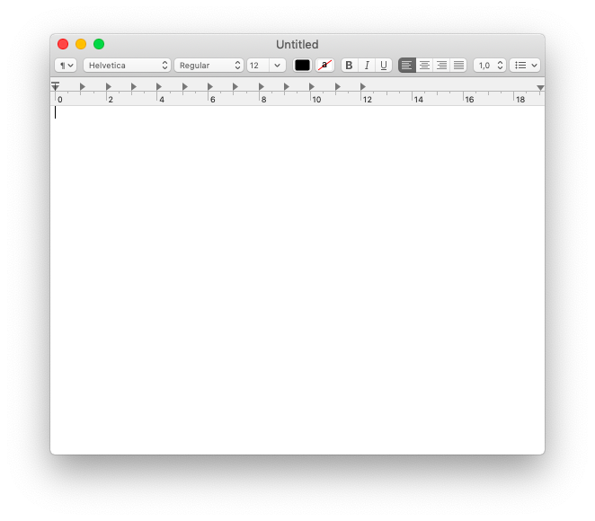
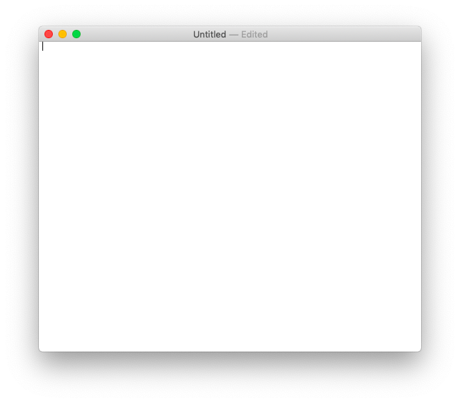
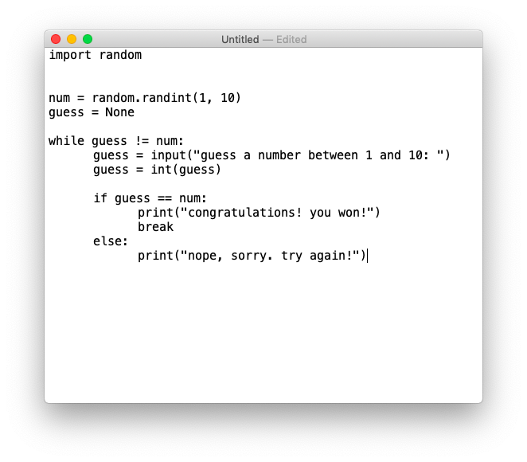
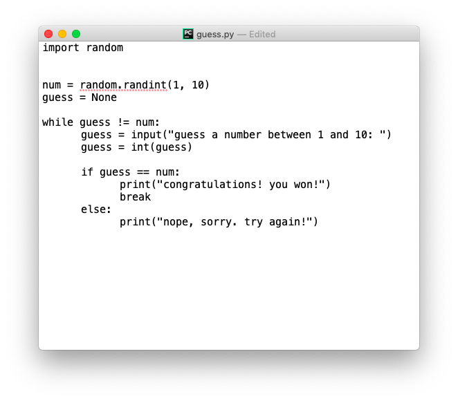

# Code Is Just Text

In this video, you will learn how to write a simple Guess-the-numbers game in a normal text editor. Don't worry if you don't yet understand everything that's going on here. The main point is that you get to see how **code is just text**. Let's go ahead and build and run your first interactive Python program on your own computer.

**Note**: Depending on what Operating System you are using, Python might not be installed yet. This post won't go into how to install Python. If you are on Windows and you don't have Python pre-installed, you can also build the game in an online coding interface, such as [repl.it](https://repl.it/).

## Build the Game

Open up any Text Editor - this can be as simple as the built-in TextEdit program on MacOS:



Code is just plain text. So, if you're using TextEdit, you can press <kbd>Cmd</kbd>+<kbd>Shift</kbd>+<kbd>t</kbd> to switch to plain text. Doing so means that you can't apply any formatting, such as bold or italics. Remember that code is just text, so you won't need any formatting for it. Your window should look like this now:



Now it's time to write some code! Type the following code into your TextEdit file:

```python
import random


num = random.randint(1, 10)
guess = None

while guess != num:
    guess = input("guess a number between 1 and 10: ")
    guess = int(guess)
    
    if guess == num:
        print("congratulations! you won!")
        break
    else:
        print("nope, sorry. try again!")
```

Make sure you type it out as-is, including the 4 spaces for **indentation**. Your text window should look like this:



Finally, let's save it and give it a name, then top it off with the python file extension `.py`. Press <kbd>Cmd</kbd>+<kbd>s</kbd> or go to _File/Save_ and save it on your Desktop with the name `guess.py`:



And that's it for writing the code. Next step is we need to run it to play that game!

---

Learn more and get yourself started working with one of the most popular programming languages in our [Python Online Bootcamp](https://codingnomads.co/courses/python-bootcamp-online/).