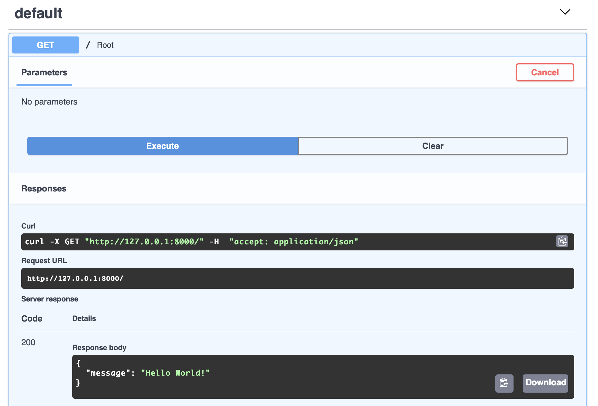

# Gotta go Fast: Writing an API with Python and FastAPI

One of the many great reasons to use Python for development is the vast amount of mature and stable libraries to choose from. When it comes to web development, [Django](https://www.djangoproject.org) and [Flask](https://flask.pocoo.org) offer a great development experience and troves of documentation that has been written over the years.

Recently the Python ecosystem has been seeing some exciting new development powered by new features available only in Python 3+ such as [coroutines](https://docs.python.org/3/library/asyncio-task.html) and [optional typing](https://docs.python.org/3/library/typing.html). This new era of libraries and frameworks promise both greater speed and ease of development to bring Python on par with newer languages like Go and Rust, while keeping the core experience that has made Python so popular.

[FastAPI](https://fastapi.tiangolo.com) is one of these new frameworks for developing web APIs that has been gaining popularity over the last few years. If you are planning on doing web development with Python now or in the future, it would be a good idea to be familiar with it.

In this article you will:

 * Create a new FastAPI project from scratch.
 * Create an API for fellow coding nomads to submit remote working locations.
 * Save the app's data to a real database using an ORM.

## Setting up the Project

To get started you will go through the usual Python project song and dance. Create a new folder for your project, and then create a new virtual environment inside it:

    python3 -m venv env/

And activate it:

    source env/bin/activate

Now you can install FastAPI and uvicorn, an ASGI server:

    pip install fastapi uvicorn

And now you should be ready to write some code.

## Starting with "Hello World"

Before you delve into coffee shops and libraries, you should have the traditional "Hello World" app up in running in FastAPI. This will allow you to prove that your initial setup is working properly.

Open up your favorite editor and paste the following code into a file called `main.py`. You'll use this file for the remainder of your development.

```python
from fastapi import FastAPI, Depends

app = FastAPI()

@app.get('/')
async def root():
    return {'message': 'Hello World!'}
```

In just 5 lines, you've already created a working API. If you've ever used Flask this should look very familiar. The last 3 lines are the most interesting:

```python
@app.get('/')
```

This is the route. It tells FastAPI that the following method should be run when the user requests the `/` path.

```python
async def root():
```

This is the method declaration. Notice the `async def`: this method will be run as a Python3 coroutine! If you'd like to learn more about concurrency and async, FastAPI itself has a [great explanation](https://fastapi.tiangolo.com/async/) of the whole thing and what makes it so fast.

Finally, the return:

```python
    return {'message': 'Hello World!'}
```

As you might expect, visiting this endpoint will return a JSON response matching the dictionary above.

Enough talk, let's run it!

    uvicorn main:app --reload

Now try visiting [http://127.0.0.1:8000](http://127.0.0.1:8000) in your browser. You should see this:

```json
{"message":"Hello World!"}
```
Perfect. But that's not it, FastAPI has also automatically generated fully interactive API documentation that you can use to interact with your new API. Visit [http://127.0.0.1:8000/docs](http://127.0.0.1:8000/docs) in your browser. You should see something like this:



Here you can see the endpoint that was just defined, and even execute it straight from your browser!

Since you are creating an API only with no frontend user interface, you'll be using this interactive documentation as the main method of interacting with the API.

## Defining Models and Business Logic

Now that you've seen the basics, let's get started working out the business logic. The first thing you are going to do is create a Pydantic model to represent a `Place`. You'll also define a route to create a new Place. Add the following code so that your `main.py` looks like this:

```python
from fastapi import FastAPI, Depends
from pydantic import BaseModel
from typing import Optional, List

app = FastAPI()

class Place(BaseModel):
    name: str
    description: Optional[str] = None
    coffee: bool
    wifi: bool
    food: bool
    lat: float
    lng: float

    class Config:
        orm_mode = True

@app.post('/places/')
async def create_place_view(place: Place):
    return place

@app.get('/')
async def root():
    return {'message': 'Hello World!'}
```

You can see that your model contains the fields you should expect for a place you'd like to add to the database: a name and description, whether the place has coffee, wifi and/or food, and latitude and longitude so that you can locate it or view it on a map.

Don't worry about the `orm_mode` bit yet, that's for use later when you hook up a database.

The `create_place` method simply takes a Place as a parameter, and returns it. Soon, you'll actually save it to a database so it persists.

Try it out in the interactive API docs. Select the `/places/` route, and click the "try it out" button. Fill in some values for the example place (or just use the defaults) and press execute. You should see the API response below, mirroring the values you put in! Notice FastAPI also gives you a cURL command string, so you can even try it from your terminal if you'd like.

The example is neat, but you should probably actually save the data to a database so that it can be queried later.

## Adding a Database

Setting up a database is going to require a little more configuration and the installation of some more software. First install [SqlAlchemy](https://www.sqlalchemy.org) a "Python Toolkit and Object Relational Mapper.":

    pip install sqlalchmemy

__As of this writing, sqlalchemy 1.4 is still in beta, but it's what you'll be using since it mirrors 2.0's API and will eventually replace anything < 1.4. If you're reading this fresh off the press, make sure you use the --pre flag: `pip install sqlalchemy --pre`__

For this demonstration you'll be using sqlite3 for your database since it requires no special setup or servers to run. Edit `main.py` so that it looks like this:


```python
from fastapi import FastAPI, Depends
from pydantic import BaseModel
from typing import Optional, List
from sqlalchemy import create_engine
from sqlalchemy.orm import declarative_base, sessionmaker, Session
from sqlalchemy import Boolean, Column, Float, String, Integer

app = FastAPI()

#SqlAlchemy Setup
SQLALCHEMY_DATABASE_URL = 'sqlite+pysqlite:///./db.sqlite3:'
engine = create_engine(SQLALCHEMY_DATABASE_URL, echo=True, future=True)
SessionLocal = sessionmaker(autocommit=False, autoflush=False, bind=engine)
Base = declarative_base()

# Dependency
def get_db():
    db = SessionLocal()
    try:
        yield db
    finally:
        db.close()

class Place(BaseModel):
    name: str
    description: Optional[str] = None
    coffee: bool
    wifi: bool
    food: bool
    lat: float
    lng: float

    class Config:
        orm_mode = True

@app.post('/places/')
async def create_place_view(place: Place):
    return place

@app.get('/')
async def root():
    return {'message': 'Hello World!'}
```

This is somewhat more complex that what you've seen so far, but don't worry, you don't need to understand exactly what is happening here, just know that these objects are what allow you to create and use a database to store your Places.

Next, let's define a Place __database__ sqlalchemy model along with an instruction to create the table. **Add the following code just below the `get_db()` method**:

```python
class DBPlace(Base):
    __tablename__ = 'places'

    id = Column(Integer, primary_key=True, index=True)
    name = Column(String(50))
    description = Column(String, nullable=True)
    coffee = Column(Boolean)
    wifi = Column(Boolean)
    food = Column(Boolean)
    lat = Column(Float)
    lng = Column(Float)

Base.metadata.create_all(bind=engine)
```

This is the object that will be used to actually fetch and insert rows into the database.

> Aside:
> Acute readers might notice that this model looks a lot like the Pydantic `Place` model you already defined earlier on. Aren't you repeating yourself? And indeed, there are many frameworks that avoid this dual definition. However, over the years backend engineers collectively learned that very rarely does the data stored in a database exactly match the desired representation presented to the user. Take a `User` object for example. You could define this model once, and use it to generate JSON to send to your endpoints for a user to consume. But it probably contains a hashed password, admin flags, and other sensitive information you don't want to be exposed, or aren't provided when the object is created. So somewhere, such as a serializer, you would still have to create some exceptions to the one-to-one mapping. This is so common that it makes more sense to decouple the database representation completely from the "schema" representation, even if it means repeating yourself sometimes!


Next you should define some methods to insert and fetch places from the database.
**Add the following code Just after your `class Place(BaseModel):` class:**

```python
def get_place(db: Session, place_id: int):
    return db.query(DBPlace).where(DBPlace.id == place_id).first()

def get_places(db: Session):
    return db.query(DBPlace).all()

def create_place(db: Session, place: Place):
    db_place = DBPlace(**place.dict())
    db.add(db_place)
    db.commit()
    db.refresh(db_place)

    return db_place
```

These three methods are responsible for getting a single `Place`, getting all the `Place`s, and creating a new `Place`. The first parameter is always `db`: it's type is a SqlAlchemy session. The rest of the parameters depend on what you're going to do. For retrieving a single place, you just need the `place_id`. For creating a place, you want the entire Pydantic `Place` model (not the DBPlace model!) so you can create a record from it. For retrieving all places you don't need any more information, you just return all the `Place`s in the database.

Finally you should add some views to tie it all together so you can create and view some places! Replace the `create_place_view` method you created earlier with the following code:

```python
@app.post('/places/', response_model=Place)
def create_places_view(place: Place, db: Session = Depends(get_db)):
    db_place = create_place(db, place)
    return db_place

@app.get('/places/', response_model=List[Place])
def get_places_view(db: Session = Depends(get_db)):
    return get_places(db)

@app.get('/place/{place_id}')
def get_place_view(place_id: int, db: Session = Depends(get_db)):
    return get_place(db, place_id)
```

All together, your `main.py` file should look like this:

```python
from fastapi import FastAPI, Depends
from pydantic import BaseModel
from typing import Optional, List
from sqlalchemy import create_engine
from sqlalchemy.orm import declarative_base, sessionmaker, Session
from sqlalchemy import Boolean, Column, Float, String, Integer

app = FastAPI()

#SqlAlchemy Setup
SQLALCHEMY_DATABASE_URL = 'sqlite+pysqlite:///./db.sqlite3:'
engine = create_engine(SQLALCHEMY_DATABASE_URL, echo=True, future=True)
SessionLocal = sessionmaker(autocommit=False, autoflush=False, bind=engine)
Base = declarative_base()

# Dependency
def get_db():
    db = SessionLocal()
    try:
        yield db
    finally:
        db.close()

class DBPlace(Base):
    __tablename__ = 'places'

    id = Column(Integer, primary_key=True, index=True)
    name = Column(String(50))
    description = Column(String, nullable=True)
    coffee = Column(Boolean)
    wifi = Column(Boolean)
    food = Column(Boolean)
    lat = Column(Float)
    lng = Column(Float)

Base.metadata.create_all(bind=engine)

class Place(BaseModel):
    name: str
    description: Optional[str] = None
    coffee: bool
    wifi: bool
    food: bool
    lat: float
    lng: float

    class Config:
        orm_mode = True

def get_place(db: Session, place_id: int):
    return db.query(DBPlace).where(DBPlace.id == place_id).first()

def get_places(db: Session):
    return db.query(DBPlace).all()

def create_place(db: Session, place: Place):
    db_place = DBPlace(**place.dict())
    db.add(db_place)
    db.commit()
    db.refresh(db_place)

    return db_place

@app.post('/places/', response_model=Place)
def create_places_view(place: Place, db: Session = Depends(get_db)):
    db_place = create_place(db, place)
    return db_place

@app.get('/places/', response_model=List[Place])
def get_places_view(db: Session = Depends(get_db)):
    return get_places(db)

@app.get('/place/{place_id}')
def get_place_view(place_id: int, db: Session = Depends(get_db)):
    return get_place(db, place_id)

@app.get('/')
async def root():
    return {'message': 'Hello World!'}
```

Here you have an endpoint per database action. They are simple wrappers around the database functions that you defined above. In a real app, these views might be more complicated and contain extra logic.

Open up the [auto generated docs](http://127.0.0.1:8000/docs) in your browser, you should see these news endpoints listed. You can also interact with them. Try creating a few places using the "Post /places/" endpoint. Once that is done, use the "Get /places/" endpoint to retrieve them.

## Conclusion

Congrats! You now have a fully functional API that serves a database of remote working locations.

To learn more, including how to deploy your application so that others can use it, check out the excellent [FastAPI Docs](https://fastapi.tiangolo.com)

Happy Travels!
